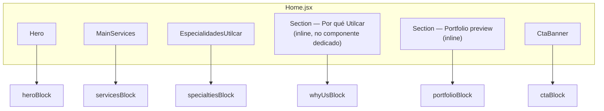
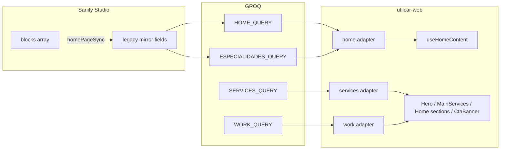
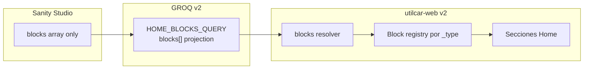

# Alineación frontend — Page Builder (`homePage.blocks[]`)

**Estado:** documentación de migración — **sin implementación en producción**  
**Última revisión:** fase de alineación post-convergencia CMS (Sanity Studio)

El Studio ya edita `blocks[]` como fuente única; el frontend sigue consumiendo **campos planos** vía GROQ (`HOME_QUERY`). Este documento define el puente hacia consumo directo de bloques.

Documentación relacionada:

- Studio: [`utilcar-studio/docs/CMS_CONVERGENCE.md`](../utilcar-studio/docs/CMS_CONVERGENCE.md)
- Studio mapping técnico: [`utilcar-studio/docs/FRONTEND_MIGRATION.md`](../utilcar-studio/docs/FRONTEND_MIGRATION.md)
- Código mapping: [`utilcar-studio/schemas/governance/homePageMigration.js`](../utilcar-studio/schemas/governance/homePageMigration.js)

---

## 1. Mapping visual: `blocks[]` → UI actual

### Orden de la página Home (`src/pages/Home.jsx`)



### Tabla bloque CMS → componente React

| Bloque Sanity (`_type`) | Nombre conceptual | Componente / UI real | Hook / datos |
|-------------------------|-------------------|----------------------|--------------|
| `heroBlock` | HeroSection | [`Hero.jsx`](../src/components/sections/Hero.jsx) | `useHomeContent().hero` |
| `specialtiesBlock` | SpecialtiesSection | [`EspecialidadesUtilcar.jsx`](../src/components/sections/EspecialidadesUtilcar.jsx) | `useEspecialidades()` ← `specialtiesNew` / merge |
| `servicesBlock` | ServicesSection | [`MainServices.jsx`](../src/components/sections/MainServices.jsx) | Cabecera: `useHomeContent().services` · Tarjetas: `useServices()` ⚠️ |
| `whyUsBlock` | WhyUsSection | `Home.jsx` — grid 3 columnas (inline) | Cabecera: `useHomeContent().highlights` · Ítems: `useHighlights()` ⚠️ |
| `portfolioBlock` | PortfolioSection | `Home.jsx` — grid trabajos (inline) | Cabecera: `useHomeContent().portfolioPreview` · Cards: `useTrabajosPreview()` ⚠️ |
| `ctaBlock` | CTASection | [`CtaBanner.jsx`](../src/components/sections/CtaBanner.jsx) | `useHomeContent().ctaBanner` |

⚠️ = hoy el **contenido de ítems** no sale del bloque Home en GROQ; ver dependencias cruzadas abajo.

### Diagrama de flujo de datos (hoy — Fase 1)



### Diagrama objetivo (Fase 2 — blocks directos)



---

## 2. Dependencias legacy (campos planos)

### Campos planos en `homePage` usados por el frontend

| Campo plano | GROQ (`HOME_QUERY`) | Consumidor | Deprecated |
|-------------|---------------------|------------|------------|
| `hero` | ✅ | `Hero.jsx` | ✅ Fase 3 |
| `services` | ✅ | `MainServices.jsx` (solo cabecera) | ✅ Fase 3 |
| `highlights` | ✅ (eyebrow, title) | `Home.jsx` sección Why Us | ✅ Fase 3 |
| `portfolioPreview` | ✅ | `Home.jsx` sección Portfolio | ✅ Fase 3 |
| `ctaBanner` | ✅ | `CtaBanner.jsx` | ✅ Fase 3 |
| `especialidades` | ✅ (metadatos sección) | `EspecialidadesUtilcar.jsx` cabecera | ✅ Fase 3 |
| `specialtiesNew` | ✅ (`ESPECIALIDADES_QUERY`) | `useEspecialidades` / merge | ✅ Fase 3 |
| `especialidadesList` | ❌ no en HOME_QUERY | fallback legacy interno | ✅ eliminar |
| `schemaVersion` | ✅ alias `_schemaVersion` | `validate.js` | mantener en doc |

### Dependencias fuera de `homePage` (gap de alineación)

Estos datos **no están en `blocks[]` hoy** a nivel de consumo frontend:

| UI Home | Datos actuales | Origen Sanity | Bloque CMS preparado |
|---------|----------------|---------------|----------------------|
| Tarjetas servicios (`MainServices`) | `useServices()` | `servicesPage.services[]` | `servicesBlock.items[]` ✅ en Studio, no en GROQ Home |
| Grid Why Us (`Home.jsx`) | `useHighlights()` | `servicesPage.highlights[]` | `whyUsBlock.items[]` ✅ en Studio, no en GROQ Home |
| Grid portfolio (`Home.jsx`) | `useTrabajosPreview()` | `workPage.portfolio[]` | `portfolioBlock.items[]` ✅ en Studio, no en GROQ Home |

**Conclusión:** los bloques del Page Builder ya modelan el contenido de forma completa en Studio; el frontend aún **no lee** `items[]` de esos bloques y depende de otros documentos o del espejo parcial.

### Archivos frontend a tocar en migración

| Archivo | Rol |
|---------|-----|
| [`src/lib/sanity/queries.js`](../src/lib/sanity/queries.js) | `HOME_QUERY`, proyección `blocks[]` |
| [`src/lib/sanity/fetch.js`](../src/lib/sanity/fetch.js) | fetch home / especialidades |
| [`src/lib/cms/home.adapter.js`](../src/lib/cms/home.adapter.js) | merge local + Sanity |
| [`src/lib/cms/homeBlocks.resolver.js`](../src/lib/cms/homeBlocks.resolver.js) | **nuevo** — blocks → vista Home |
| [`src/lib/schemas/home.schema.js`](../src/lib/schemas/home.schema.js) | Zod v2 |
| [`src/lib/contracts/home.contract.js`](../src/lib/contracts/home.contract.js) | contrato v2 |
| [`src/hooks/useCms.js`](../src/hooks/useCms.js) | hooks por bloque o `useHomeBlocks` |
| [`src/pages/Home.jsx`](../src/pages/Home.jsx) | orden por `blocks[].order` + `enabled` |
| Componentes `sections/*` | props desde bloque, no flat |

**Sin cambiar en Fase 1:** `merge.js`, `normalize.js` (salvo extensión explícita para blocks).

---

## 3. Contrato v2 — `blocks[]` como única fuente

### Documento Sanity (objetivo)

```ts
type HomePageDocumentV2 = {
  _type: 'homePage'
  _id: 'homePage'
  schemaVersion: 2
  blocks: HomeBlock[] // única fuente editorial y de runtime
}

type HomeBlockBase = {
  _type: string
  _key: string
  enabled: boolean
  order: number
}

type HeroBlock = HomeBlockBase & {
  _type: 'heroBlock'
  title: string
  subtitle: string
  highlights: string[]
  secondaryLink: { label: string; to: string; ariaLabel?: string }
  imageAlt: string
}

type SpecialtiesBlock = HomeBlockBase & {
  _type: 'specialtiesBlock'
  eyebrow?: string
  title?: string
  description?: string
  items: Specialty[] // mismo shape que specialty + normalize canonicalId
}

type ServicesBlock = HomeBlockBase & {
  _type: 'servicesBlock'
  eyebrow: string
  title: string
  description: string
  cardLinkLabel: string
  items: Array<{
    title: string
    description: string
    icon?: string
    link: { label: string; path: string }
  }>
}

type WhyUsBlock = HomeBlockBase & {
  _type: 'whyUsBlock'
  eyebrow: string
  title: string
  items: Array<{ title: string; description: string; icon?: LucideIcon }>
}

type PortfolioBlock = HomeBlockBase & {
  _type: 'portfolioBlock'
  eyebrow: string
  title: string
  description: string
  ctaLabel: string
  ctaTo: string
  previewCount: number
  items: Array<{
    title: string
    subtitle?: string
    description: string
    image?: SanityImage
  }>
}

type CtaBlock = HomeBlockBase & {
  _type: 'ctaBlock'
  title: string
  description: string
  buttonLabel: string
  buttonLink: string
  buttonText?: string
}
```

### Vista resuelta para React (runtime)

```ts
type ResolvedHomePage = {
  blocks: Array<
    | { type: 'hero'; data: HeroProps }
    | { type: 'specialties'; data: SpecialtiesSectionProps }
    | { type: 'services'; data: MainServicesProps }
    | { type: 'whyUs'; data: WhyUsSectionProps }
    | { type: 'portfolio'; data: PortfolioSectionProps }
    | { type: 'cta'; data: CtaBannerProps }
  >
}
```

### GROQ v2 (borrador — no implementar aún)

```groq
*[_type == "homePage"][0]{
  "_schemaVersion": schemaVersion,
  blocks[]{
    _type,
    _key,
    enabled,
    order,
    // proyección por tipo vía select() o fragmentos
  }
}
```

**Eliminación objetivo:** sin `hero`, `services`, `highlights`, `portfolioPreview`, `ctaBanner`, `specialtiesNew` en query ni adapter flattening.

---

## 4. Plan de migración segura

### Fase 1 — Dual system (**actual**)

| Capa | Comportamiento |
|------|----------------|
| Studio | `blocks[]` escribe; campos planos = mirror GROQ |
| GROQ | `HOME_QUERY` + queries auxiliares (services, work, especialidades) |
| Frontend | Consume planos + bundles externos |
| Riesgo | Bajo — producción estable |

**Criterio de salida:** documentación aprobada (este doc) + `HOME_BLOCKS_QUERY` diseñada.

### Fase 2 — Consumo directo de blocks (feature flag)

**Implementado (capa resolver, sin cambiar componentes):**

- `src/lib/cms/homeResolver.js` → `getResolvedHomeContent()`
- `VITE_USE_BLOCK_RESOLVER=true` en `.env.local`
- Debug consola: `[utilcar home] source: blocks resolver`

1. ~~Añadir `VITE_USE_HOME_BLOCKS=true`~~ → usar `VITE_USE_BLOCK_RESOLVER` en [`config.js`](../src/lib/cms/config.js).
2. Implementar `HOME_BLOCKS_QUERY` y `resolveHomeBlocks()` (normalizar `_type`, `enabled`, orden).
3. Adapter: si flag ON y `blocks.length`, usar resolver; si no, fallback Fase 1.
4. Refactor por sección:
   - `Hero` ← `heroBlock`
   - `EspecialidadesUtilcar` ← `specialtiesBlock.items` (reutilizar `normalizeSpecialtyList`)
   - `MainServices` ← `servicesBlock` (cabecera + `items`, dejar de depender de `servicesPage` en Home)
   - Why Us inline ← `whyUsBlock` (cabecera + `items`, dejar de depender de `useHighlights` en Home)
   - Portfolio inline ← `portfolioBlock` (`items` o fallback `workPage` si items vacío)
   - `CtaBanner` ← `ctaBlock`
5. `Home.jsx`: renderizar secciones según `blocks` ordenados y `enabled`.
6. Tests manuales: Studio change → sitio sin editar mirror manualmente.
7. Mantener mirror Studio activo para rollback.

**Criterio de salida:** Home completo con flag ON en staging; paridad visual con flag OFF.

### Fase 3 — Eliminación mirror y cleanup

1. Flag ON por defecto en producción.
2. Quitar campos planos de `homePage` schema (Studio).
3. Eliminar `homePageSync.js` mirror.
4. Simplificar `HOME_QUERY` a solo `blocks[]`.
5. Deprecar lectura de `servicesPage` / `workPage` **solo para Home** (documentos siguen para rutas `/servicios`, `/trabajos`).
6. `schemaVersion` → `2` en Studio y validación Zod.
7. Actualizar [`SANITY_INTEGRACION.md`](SANITY_INTEGRACION.md) si existe.

**Criterio de salida:** ningún campo plano en documento `homePage`; GROQ sin flattening.

---

## 5. Validación conceptual — bloques vs campos planos

### En Sanity (Studio) — ✅ listo

| Bloque | ¿Contenido editable en `blocks[]`? | ¿Depende conceptualmente del flat? |
|--------|-----------------------------------|-------------------------------------|
| `heroBlock` | ✅ completo | ❌ no |
| `specialtiesBlock` | ✅ `items[]` | ❌ no (flat es espejo) |
| `servicesBlock` | ✅ cabecera + `items[]` | ❌ no |
| `whyUsBlock` | ✅ cabecera + `items[]` | ❌ no |
| `portfolioBlock` | ✅ cabecera + `items[]` | ❌ no |
| `ctaBlock` | ✅ botones editables | ❌ no |

Ningún bloque **requiere** campos planos para existir en el CMS; el mirror es mecánico para GROQ legacy.

### En frontend (hoy) — ⚠️ pendiente Fase 2

| Sección | ¿Depende de flat? | ¿Depende de otro doc? |
|---------|------------------|------------------------|
| Hero | ✅ `hero` | ❌ |
| Especialidades | ✅ `specialtiesNew` + `especialidades` meta | ❌ |
| Servicios cabecera | ✅ `services` | ❌ |
| Servicios tarjetas | ❌ | ✅ `servicesPage` |
| Why Us cabecera | ✅ `highlights` | ❌ |
| Why Us tarjetas | ❌ | ✅ `servicesPage.highlights` |
| Portfolio cabecera | ✅ `portfolioPreview` | ❌ |
| Portfolio tarjetas | ❌ | ✅ `workPage` |
| CTA | ✅ `ctaBanner` | ❌ |

**Meta validación:** tras Fase 2, ninguna sección de Home debe leer campos planos ni otros singletons salvo fallback explícito documentado.

---

## 6. Checklist pre-implementación

- [ ] Revisar paridad `serviceBlockItem` ↔ `ServiceItemSchema`
- [ ] Revisar paridad `whyUsBlockItem` ↔ `HighlightItemSchema`
- [ ] Revisar paridad `portfolioBlockItem` ↔ tarjetas `trabajos`
- [ ] Definir estrategia iconos (`whyUs` / `services`) — string Lucide vs componente
- [ ] Orden dinámico Home: respetar `blocks[].order` y `enabled`
- [ ] Seed / contenido existente: migración documento Sanity si hace falta script
- [ ] No modificar `merge.js` / `normalize.js` hasta PR dedicado
- [ ] Rollback: `VITE_USE_HOME_BLOCKS=false`

---

## Resumen ejecutivo

El Page Builder en Studio ya es **conceptualmente autónomo** (`blocks[]`). El frontend sigue en **Fase 1** por diseño: lee espejos GROQ y dos fuentes cruzadas (`servicesPage`, `workPage`). La migración consiste en un resolver de bloques y en dejar de aplanar datos en queries — **sin cambios en producción hasta activar el flag de Fase 2**.
