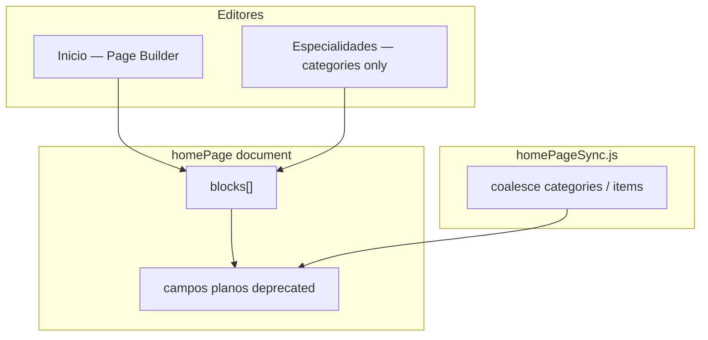

# CMS Convergencia — Sanity Studio


Estado actual del modelo híbrido `homePage` y roadmap hacia `blocks[]` como fuente única.


## Source of truth editorial





| Vista Structure | Qué edita | Quién |

|-----------------|-----------|-------|

| **Inicio** | `blocks[]` completo (hero, services, portfolio, …) | Editor |

| **Especialidades** | Solo `specialtiesBlock.categories[]` | Editor |

| **Advanced Legacy Mode** | Espejos planos read-only | Admin |

| **Sync debug badge** | Metadata último reconcile | Admin + DEV |


## Roadmap de migración


| Fase | Estado | Descripción |

|------|--------|-------------|

| **Convergencia** | ✅ Activo | `blocks[]` = edición; campos planos = espejo GROQ deprecated |

| **Specialties domain** | ✅ Studio | `categories[]` + entidades hijas; mirror legacy via coalesce |

| **Frontend v2** | Pendiente | GROQ/queries leen `blocks[]` directamente |

| **Cleanup** | Pendiente | Eliminar campos planos del schema y sync |


### Reglas activas (Studio)


1. **Solo `blocks[]` escribe** contenido editorial.

2. **Campos planos** (`hero`, `specialtiesNew`, …) se actualizan por sync pasivo (`homePageSync.js`).

3. **Specialties mirror:** `specialtiesNew ← coalesce(categories[], items[])` — categories gana si tiene contenido.

4. **Escritura dual rechazada**: si se edita un campo plano con blocks activos, el valor se revierte.

5. **Advanced (Legacy Mode)** (admin): espejos + `items[]` legacy + sync metadata.


## Workflow editorial


1. **Contenido general Home** → menú **Inicio** → Page Builder → reordenar / editar bloques.

2. **Especialidades** → menú **Especialidades** → categorías, marcas, galerías, features, CTAs (sin duplicar otros bloques).

3. **Marcas globales** → menú **Marcas** → referenciables desde `specialtyBrand.brandRef`.

4. **Diagnóstico** (admin) → tab Advanced Legacy Mode o badge Sync debug.


## Debug de sincronización


En desarrollo (`import.meta.env.DEV`), cada reconcile loguea en consola:


```

[utilcar homePage] source: blocks

[utilcar homePage] source: legacy sync

[utilcar homePage] source: legacy sync (mirror)

```


Desactivar logs: `SANITY_STUDIO_DEBUG_SYNC=false` en `.env`.


El badge **Sync debug** en Page Builder muestra el último evento (**solo admin**).


## Orígenes (`SYNC_SOURCE`)


| Valor | Significado |

|-------|-------------|

| `blocks` | Cambio en blocks → mirror a campos planos |

| `legacy-sync` | Migración inicial flat → blocks |

| `legacy-mirror-rejected` | Intento de editar flat con blocks activo |

| `bootstrap` | Sin blocks; seed desde flat (raro) |

| `none` | Sin patches |


## Archivos clave


- `structure.js` — singleton Inicio + Especialidades enfocado

- `schemas/presentation/components/HomePageRootInput.jsx` — routing builder / legacy / specialties

- `schemas/presentation/components/HomeSpecialtiesItemsInput.jsx` — editor categories[]

- `schemas/content/specialties/` — dominio specialtyCategory, specialtyBrand, …

- `schemas/governance/homePageSync.js` — reconciliación + `readSpecialtiesFromBlock`
- `schemas/governance/migrations/` — migración CLI `items[]` → `categories[]`

- `schemas/governance/specialtiesValidators.js` — governance specialties

- `schemas/presentation/components/editorial/` — componentes UX reutilizables

- [`utilcar-web/docs/HOME_PAGE_BUILDER_ALIGNMENT.md`](../../utilcar-web/docs/HOME_PAGE_BUILDER_ALIGNMENT.md) — migración frontend

- [`docs/SPECIALTIES_DOMAIN_MODEL.md`](./SPECIALTIES_DOMAIN_MODEL.md) — dominio Especialidades

- `docs/FRONTEND_MIGRATION.md` — índice migración frontend

