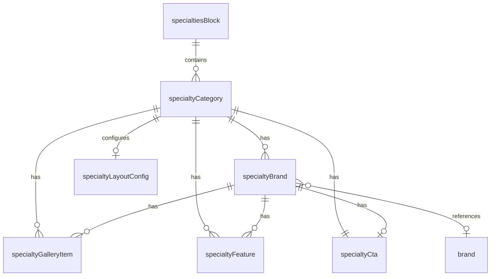
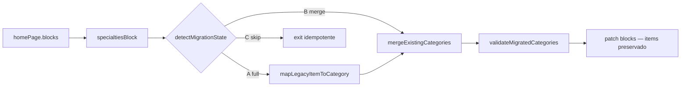

# Specialties Domain Model — Arquitectura editorial escalable

Documento de diseño del dominio `specialtiesBlock` como sistema modular extensible (tabs, marcas, galerías, especificaciones, CTAs).

**Estado Studio (2026-05):** schemas implementados en `schemas/content/specialties/`.  
**Fuera de alcance (fase actual):** runtime frontend, GROQ productivo, resolvers activos, `Home.jsx`.

---

## 1. Contexto y problema

### Estado actual (2026)

| Capa | Situación |
|------|-----------|
| **Studio** | `specialtiesBlock.categories[]` → `specialtyCategory` (+ marcas, galerías, features, CTA). `items[]` legacy solo admin. |
| **Sync** | `coalesce(categories[], items[])` → espejo `specialtiesNew` (`homePageSync.readSpecialtiesFromBlock`) |
| **Frontend** | `EspecialidadesUtilcar` consume shape legacy vía mirror — sin cambios runtime |
| **Marcas** | `specialtyBrand.brandRef` → documento `brand` |
| **Contrato draft** | `utilcar-web/src/lib/cms/contracts/specialtiesContract.js` |

### Limitaciones del modelo monolítico

Un único objeto `specialty` mezcla:

- Narrativa de marketing (intro, título)
- Especificaciones técnicas (hoy `features[]` plano; frontend usa `specGroups[]`)
- Media (una sola imagen)
- Navegación (CTA)
- Futuro: tabs por línea de negocio, marcas anidadas, galerías por marca

Crecer el objeto inline genera:

- Formularios largos con scroll infinito
- Validación inconsistente
- Imposibilidad de reutilizar marcas entre categorías
- Drift Studio ↔ contrato frontend ↔ merge local

### Objetivo del nuevo dominio

**Separar entidades**, mantener **ownership claro** en `specialtiesBlock`, y preparar evolución en 3 fases sin reescribir el sitio.

---

## 2. Principios de diseño

1. **Block ownership** — `specialtiesBlock` es la fuente editorial de la sección Home; entidades hijas viven **embebidas o referenciadas** bajo categorías, no sueltas en el documento raíz.
2. **Composición sobre herencia** — Categorías contienen marcas, features, galerías y CTAs; no un mega-campo JSON.
3. **Referencias vs embed** — Marcas globales (`brand` document) referenciables; contenido específico de Home embebido en la categoría.
4. **Contrato estable, extensión opcional** — Campos futuros (`layoutConfig`, `gallery[]`) no rompen Fase 1.
5. **Editor-first UX** — El editor ve tabs, cards y warnings; admin ve identidad, slugs bloqueados y layout técnico.
6. **Paridad con Block Resolver** — Shape final consumible por `specialtiesContract` + `extensions.specialtiesSection` (implementación futura, no en esta fase).

---

## 3. Entidades del dominio

### 3.1 `specialtyCategory` (tab / sección principal)

Unidad editorial principal. En Fase 1 equivale a una “especialidad” visible en Home (ej. Furgones, Buses escolares, Banquetas).

| Campo (draft) | Tipo | Rol |
|---------------|------|-----|
| `canonicalId` | string (hidden, admin) | Identidad estable para merge frontend |
| `slug` | slug (admin, locked post-publish) | URLs futuras `/especialidades/:slug` |
| `title` | string | H1 de bloque |
| `subtitle` | string | Subtítulo comercial |
| `intro` | text | Párrafo principal (mapea `intro` legacy) |
| `eyebrow` | string? | Override por ítem (default desde bloque) |
| `heroImage` | image | Imagen principal del bloque alternado |
| `heroImageAlt` | string | Alt accesible |
| `brands` | `specialtyBrand[]` | Marcas / sub-líneas (Fase 1+) |
| `features` | `specialtyFeature[]` | Specs a nivel categoría (sin marca) |
| `gallery` | `specialtyGalleryItem[]` | Galería general de categoría |
| `cta` | `specialtyCta` | Acción principal de la categoría |
| `layoutConfig` | `specialtyLayoutConfig` | Layout futuro (Fase 2+) |
| `order` | number | Orden dentro del bloque |
| `enabled` | boolean | Visibilidad por ítem |

**Nota migración:** El objeto actual `specialty` se descompone en `specialtyCategory` + hijos. `description` → `intro`; `features[]` → `specialtyFeature[]` o `specGroups` anidados.

---

### 3.2 `specialtyBrand` (marca asociada)

Sub-unidad bajo una categoría (ej. dentro de “Ventanas y lunetas”: Toyota, Peugeot, Renault).

| Campo (draft) | Tipo | Rol |
|---------------|------|-----|
| `reference` | ref → `brand`? | Marca global reutilizable (logo, slug) |
| `name` | string | Override display si no hay ref |
| `description` | text | Copy específico Home |
| `logo` | image? | Override si no hay ref |
| `galleries` | `specialtyGalleryItem[]` | Galería por marca |
| `features` | `specialtyFeature[]` | Specs técnicas por marca |
| `cta` | `specialtyCta?` | CTA específico (ej. ver galería ventanas Toyota) |
| `featured` | boolean | Destacar en tab UI futura |
| `order` | number | Orden dentro de categoría |

**Relación con `brand` document:** Referencia opcional. Si existe `reference`, Studio muestra logo/nombre readonly + overrides permitidos. Evita duplicar catálogo de marcas en Ventanas.

---

### 3.3 `specialtyFeature` (características / especificaciones)

Reemplazo estructurado de `features[]` string y `specGroups[]` legacy.

| Campo (draft) | Tipo | Rol |
|---------------|------|-----|
| `groupTitle` | string | Título del grupo (ej. “Especificaciones”) |
| `items` | string[] | Bullets técnicos |
| `kind` | enum | `spec` \| `benefit` \| `compliance` |
| `order` | number | Orden del grupo |

**Mapeo legacy:**

```text
specGroups[].title  → groupTitle
specGroups[].items  → items[]
features[]          → un grupo implícito “Características” (kind: benefit)
```

---

### 3.4 `specialtyGalleryItem` (media)

| Campo (draft) | Tipo | Rol |
|---------------|------|-----|
| `image` | image | Asset Sanity |
| `alt` | string | Obligatorio UX |
| `caption` | string? | Pie de foto |
| `role` | enum | `hero` \| `thumbnail` \| `gallery` \| `beforeAfter` |
| `featured` | boolean | Prioridad en grid |
| `order` | number | Orden en galería |

---

### 3.5 `specialtyCta` (acciones)

Alineado con `editorialCta` (hero/services) para consistencia Studio.

| Campo (draft) | Tipo | Rol |
|---------------|------|-----|
| `label` | string | Texto botón |
| `to` | string | Path interno (`/ventanas-lunetas`) |
| `ariaLabel` | string? | Accesibilidad |
| `styleVariant` | enum | `primary` \| `secondary` \| `outline` (reservado UI) |
| `openInNewTab` | boolean | Solo externo (futuro) |

**Mapeo legacy:** `buttonText` + `buttonLink` → `label` + `to`.

---

### 3.6 `specialtyLayoutConfig` (future layouts)

Reservado Fase 2+. No consumido por frontend en Fase 1.

| Campo (draft) | Tipo | Rol |
|---------------|------|-----|
| `variant` | enum | `alternating` \| `tabs` \| `stacked` \| `brandGrid` |
| `imagePosition` | enum | `left` \| `right` \| `background` |
| `showBrandTabs` | boolean | UI tabs por marcas |
| `columns` | number | Grid galería (2–4) |
| `dense` | boolean | Modo compacto |

Default Fase 1: `{ variant: 'alternating', imagePosition: 'alternate' }` — replica layout actual `EspecialidadesUtilcar`.

---

## 4. Modelo de relaciones

### 4.1 Árbol de composición

```text
homePage
└── blocks[]
    └── specialtiesBlock                    ← OWNER sección Home
        ├── eyebrow, title, description     ← metadata sección
        ├── itemEyebrowPrefix?              ← legacy compat (opcional)
        ├── enabled, order                  ← block meta
        └── categories[]                    ← specialtyCategory (rename items[])
            ├── heroImage, intro, cta
            ├── features[]                  ← specialtyFeature
            ├── gallery[]                   ← specialtyGalleryItem
            ├── layoutConfig                ← specialtyLayoutConfig
            └── brands[]
                ├── reference → brand (document)
                ├── galleries[]
                ├── features[]
                └── cta
```

### 4.2 Diagrama entidad-relación (simplificado)



### 4.3 Ownership matrix

| Entidad | Owner documental | Editable en Page Builder | Reutilizable global |
|---------|------------------|--------------------------|---------------------|
| `specialtiesBlock` | `homePage.blocks[]` | ✅ Editor | ❌ |
| `specialtyCategory` | embebido en block | ✅ Editor | ❌ (Fase 3: optional ref) |
| `specialtyBrand` | embebido en category | ✅ Editor | ⚠️ via `brand` ref |
| `brand` | documento `brand` | ✅ Editor (menú Marcas) | ✅ |
| `specialtyFeature` | embebido | ✅ Editor | ❌ |
| `specialtyGalleryItem` | embebido | ✅ Editor | ❌ |
| `specialtyLayoutConfig` | embebido | 🔒 Admin | ❌ |

---

## 5. `specialtiesBlock` — shape draft (schema)

**No implementar aún.** Borrador objetivo para Studio:

```js
// specialtiesBlock (draft)
{
  _type: 'specialtiesBlock',
  enabled: true,
  order: 1,
  eyebrow: 'Especialidades',
  title: 'Especialidades Utilcar',
  description: '...',
  itemEyebrowPrefix: 'Especialidad',  // legacy mirror
  categories: [ specialtyCategory ],    // rename from items[]
}
```

**Estrategia de rename:** Mantener alias `items` en sync interno durante transición; nuevo nombre canónico `categories` en schema definitivo. `_type` del bloque **no cambia**.

---

## 6. Identidad y normalización

### 6.1 `canonicalId` strategy

Prioridad (alineada con `schemas/governance/identity.js`):

1. `blockMeta.blockKey` (admin, inmutable post-publish)
2. `canonicalId` explícito (admin)
3. `slug.current` (si existe)
4. `id` legacy (migración desde contenido local)
5. `hashTitle(title)` — fallback dev only; warning en Studio

**Regla:** En producción, categorías publicadas deben tener `canonicalId` o `slug` estable. No depender de hash en runtime.

### 6.2 Slug policy

| Entidad | Slug | Política |
|---------|------|----------|
| `specialtyCategory` | `slug` from title | Locked after first publish (admin unlock) |
| `brand` | ya existe | Locked (`isBrandSlugLocked`) |
| `specialtyBrand` | sin slug propio | Hereda de `brand.reference.slug` o genera `{categorySlug}-{brandSlug}` en Fase 3 |

Formato: kebab-case, sin acentos, max 96 chars.

### 6.3 Block ownership

- Una categoría **pertenece a un solo** `specialtiesBlock` en `homePage`.
- No referenciar categorías cruzadas entre páginas en Fase 1–2.
- Fase 3: document type `specialtyCategory` standalone + referencia en block (opcional enterprise).

### 6.4 Merge policy futura (frontend)

Cuando exista `specialtiesContract`:

```text
resolved = contract.normalizeCategory(cmsItem)
merged   = deepMerge(localFallback[canonicalId], resolved)
```

Reglas:

- **Textos e imágenes CMS** ganan sobre local cuando presentes.
- **Imagen local** fallback si `heroImage` vacío (Asset Resolution Layer).
- **Orden:** siempre `categories[].order` del block, no del merge.
- **Marcas:** merge por `brand.reference._ref` o `name` normalizado.

### 6.5 Ordering rules

| Nivel | Campo | Comportamiento |
|-------|-------|----------------|
| Block en Home | `blocks[].order` | Page Builder sort |
| Categoría | `order` / array order | Drag sort en Studio |
| Marca | `order` dentro de category | Drag sort |
| Galería | `order` + `featured` primero | Stable sort |
| Feature groups | `order` | Drag sort |

---

## 7. Reglas editoriales y governance

### 7.1 Roles

| Acción | Editor (Page Builder) | Admin (Advanced) |
|--------|----------------------|------------------|
| Crear/editar categorías | ✅ | ✅ |
| Reordenar categorías/marcas | ✅ | ✅ |
| Editar copy, imágenes, CTAs | ✅ | ✅ |
| Agregar marcas (embed o ref) | ✅ | ✅ |
| Editar `canonicalId`, `slug` | ❌ | ✅ |
| Editar `layoutConfig` | ❌ (hidden Fase 1) | ✅ |
| Ver campos espejo legacy | ❌ | ✅ read-only |
| Publicar documento `brand` | ✅ (menú Marcas) | ✅ |

### 7.2 Límites razonables (UX)

Reutilizar / extender `schemas/governance/constants.js`:

| Límite | Valor | Nivel |
|--------|-------|-------|
| Categorías visibles recomendadas | ≤ 6 | warning |
| Categorías máximo | ≤ 10 | error |
| Marcas por categoría | ≤ 12 | warning |
| Items por feature group | ≤ 12 | warning |
| Feature groups por categoría/marca | ≤ 4 | warning |
| Galería por categoría/marca | ≤ 24 | warning |
| Intro / description | ≤ 600 chars | soft warning |
| Título duplicado en block | — | error |

### 7.3 Validaciones UX (warnings, no bloqueantes salvo título)

**Categoría:**

- Sin `heroImage` → “El sitio usará imagen local de respaldo”
- Sin `cta.to` con `cta.label` → “CTA incompleto”
- Sin `intro` → “Falta párrafo principal”
- `brands[]` vacío en categoría tipo ventanas → “Considera agregar marcas”

**Marca:**

- Ref `brand` rota / missing → error
- Galería vacía → warning
- Sin features ni descripción → warning

**Galería:**

- Sin `alt` → warning accesibilidad
- Sin imagen → omitir en runtime (futuro)

---

## 8. Estrategia de media

### 8.1 Gallery behavior

| Contexto | Comportamiento editorial | Runtime futuro |
|----------|-------------------------|----------------|
| `heroImage` | Una imagen principal por categoría | Columna alternada Home |
| `gallery[]` categoría | Grid opcional bajo intro | Lazy load, lightbox Fase 2 |
| `brand.galleries[]` | Fotos por marca | Tabs + carrusel Fase 2 |
| `role: thumbnail` | Marca item en tab | Tab icon |
| `featured: true` | Prioridad visual | Primero en grid |

### 8.2 Thumbnail ownership

- **Categoría:** `heroImage` es thumbnail de bloque en Home.
- **Marca:** `brand.reference.logo` → thumbnail tab; override `logo` embed.
- **Galería:** primer item `featured` o first ordered → preview en Studio card.

### 8.3 Fallback images (Asset Resolution — futuro)

Prioridad por categoría:

1. CMS `heroImage.asset.url`
2. Local `ESPECIALIDADES[id].image` (merge)
3. Placeholder gradient (ya usado en otras secciones)

Prioridad por marca:

1. CMS gallery featured
2. `brand.reference.logo`
3. Local ventanas marca gallery[0]

### 8.4 Responsive concerns

- **Hero aspect:** 4:3 en Home (actual). Documentar safe zone en helper Studio.
- **Galería grid:** min 2 cols mobile, 3–4 desktop — controlado por `layoutConfig.columns` Fase 2.
- **Hotspot:** obligatorio en `heroImage` y galería principal.

### 8.5 Integración futura Asset Resolution Layer

```text
resolveSpecialtyCategoryAssets(category, localFallback)
resolveSpecialtyBrandAssets(brand, localBrandBundle)
```

Paridad con `resolveHeroAssets` / `resolveServiceAssets`. **No implementar en esta fase.**

---

## 9. Ejemplos editoriales

### 9.1 Categoría simple (Banquetas — Fase 1)

```yaml
title: Fabricación de Banquetas
subtitle: Banquetas para Mini Buses
intro: |
  Fabricamos banquetas para minibuses utilizando estructuras reforzadas...
features:
  - groupTitle: Características de fabricación
    items:
      - Estructura de tubo de 1" × 2 mm...
      - Soldadura MIG...
cta:
  label: Ver banquetas
  to: /banquetas
heroImage: { asset: ... }
brands: []   # vacío OK
layoutConfig: { variant: alternating }
```

### 9.2 Categoría con marcas (Ventanas — Fase 1 tabs-ready)

```yaml
title: Equipamiento para Furgones
subtitle: Instalación de vidrios laterales
intro: ...
brands:
  - reference: brand-toyota
    features:
      - groupTitle: Compatibilidad
        items: [Hiace, Hilux...]
    galleries:
      - image: ...
        alt: Ventana corrediza Toyota Hiace
    cta:
      label: Ver ventanas Toyota
      to: /ventanas-lunetas#toyota
  - reference: brand-peugeot
    ...
layoutConfig:
  variant: alternating
  showBrandTabs: true   # Fase 2 UI
```

### 9.3 Specs técnicas pesadas (Escolar)

Usar múltiples `specialtyFeature` groups con `kind: compliance` para normativas MTT.

---

## 10. Estrategia UX Studio (Editorial Phase)

Aplicar patrón exitoso de Hero / Portfolio:

| Componente | Uso previsto |
|------------|--------------|
| `SpecialtiesBlockEditorialInput` | Header + hints sección |
| `SpecialtyCategoryEditorialInput` | Card preview + warnings |
| `SpecialtyBrandEditorialInput` | Compact brand row + ref picker |
| `EditorialSectionHeader` | Reutilizado |
| Fieldsets | Content · Brands · Specs · Media · CTA · Advanced |

**Pane enfocado:** Extender `HomeSpecialtiesItemsInput` → edita solo `categories[]` con vista tab/list, no el documento completo.

**Menú Studio:**

- **Inicio → Especialidades** (focused pane) — editor principal
- **Marcas** — catálogo global `brand`
- **Advanced** — espejo `specialtiesNew` read-only

---

## 11. Fases de implementación

### Fase 1 — Tabs + brands (Studio + contract draft)

**Entregables:**

- Schemas: `specialtyCategory`, `specialtyBrand`, `specialtyFeature`, `specialtyCta`
- Rename `items` → `categories` en `specialtiesBlock` (alias sync)
- Migración script: `specialty` → `specialtyCategory`
- `specialtiesContract.js` (draft, sin resolver)
- Editorial UX: categoría + marca básica

**Frontend:** sin cambios runtime; sync mantiene shape legacy compatible.

### Fase 2 — Galleries + layouts

**Entregables:**

- `specialtyGalleryItem`, `specialtyLayoutConfig`
- Studio: galería grid, layout picker (admin)
- Asset Resolution: `resolveSpecialtyCategoryAssets`
- Resolver: `extensions.specialtiesSection` con categorías normalizadas
- UI Home: opcional tabs marcas (feature flag)

### Fase 3 — Dynamic rendering + dedicated pages

**Entregables:**

- Rutas `/especialidades/[slug]`
- Document standalone `specialtyCategory` (opcional) referenciado desde block
- Rendering dinámico por `layoutConfig.variant`
- Deprecar merge local progresivo
- GROQ directo a `blocks[]` sin `specialtiesNew`

---

## 12. Compatibilidad y migración

### 12.1 Mapeo `specialty` (actual) → dominio nuevo

| Campo actual | Destino |
|--------------|---------|
| `title` | `specialtyCategory.title` |
| `subtitle` | `specialtyCategory.subtitle` |
| `description` | `specialtyCategory.intro` |
| `features[]` | `specialtyFeature[]` (1 grupo) |
| `image` | `specialtyCategory.heroImage` |
| `buttonText` / `buttonLink` | `specialtyCategory.cta` |
| `blockMeta` | `specialtyCategory.canonicalId` source |

### 12.2 Lo que NO cambia en Fase 1

- `_type: 'specialtiesBlock'`
- Posición en `homePage.blocks[]`
- Espejo `specialtiesNew` (sync adaptado, no eliminado)
- Componente `EspecialidadesUtilcar` (hasta Fase 2+)

### 12.3 Riesgos mitigados

| Riesgo | Mitigación |
|--------|------------|
| Schema explosion | Objetos pequeños reutilizables, no JSON blobs |
| Drift marca ventanas | Ref a documento `brand` |
| IDs inestables | canonicalId + slug policy |
| Formulario largo | Fieldsets + focused pane + brand sub-cards |

---

## 13. Draft types registry (implementación futura)

```text
schemas/content/specialties/
  specialtyCategory.js
  specialtyBrand.js
  specialtyFeature.js
  specialtyGalleryItem.js
  specialtyCta.js
  specialtyLayoutConfig.js

schemas/content/blocks/specialtiesBlock.js   ← actualizar

schemas/presentation/components/
  SpecialtiesBlockEditorialInput.jsx
  SpecialtyCategoryEditorialInput.jsx
  SpecialtyBrandEditorialInput.jsx

utilcar-web/src/lib/cms/contracts/
  specialtiesContract.js                   ← Fase 1 draft only
```

---

## 14. Migración automática `items[]` → `categories[]`

### CLI

```bash
npm run migrate:specialties:dry   # diff sin escribir
npm run migrate:specialties       # patch homePage.blocks[]
```

Requiere `SANITY_API_TOKEN` en `utilcar-studio/.env`.

### Flujo



### Casos (`detectMigrationState`)

| Caso | Condición | Acción |
|------|-----------|--------|
| **A** | `items[]` sí, `categories[]` vacío | Migración completa |
| **B** | Ambos con ítems sin match | Merge incremental |
| **C** | Todo matcheado / solo categories | Skip seguro |
| **D** | Sin `specialtiesBlock` | Warning, exit clean |

### Reglas de merge

1. **Match** por `canonicalId` (identity.js), `slug.current`, título normalizado.
2. Si categoría existe: **preservar** brands, gallery, layoutConfig, featured; completar solo campos vacíos.
3. **Nunca** eliminar `items[]` ni mirrors GROQ.
4. `homePageSync` sigue: `coalesce(categories[], items[])`.

### Identidad canónica

| Fuente legacy | Campo destino |
|---------------|---------------|
| `id` / `blockMeta.blockKey` | `slug.current` + match key |
| `title` | `title` |
| `intro` / `description` | `description` |
| `image` | `heroImage` + `gallery[]` featured |
| `specGroups[]` / `features[]` | `features[]` |
| `cta` / `buttonText`+`buttonLink` | `specialtyCta` |

### Rollback conceptual

- `items[]` permanece intacto → revertir = vaciar `categories[]` en Studio o restaurar snapshot manual.
- No se crean documentos backup en Sanity (solo snapshot consola pre-patch).

### Archivos

- `scripts/migrate-specialties-to-categories.mjs`
- `scripts/import-specialties-from-seed.mjs` — import incremental seed → categories[]
- `schemas/governance/migrations/specialtiesMigration.js`
- `schemas/governance/migrations/specialtiesSeedImport.js`
- `schemas/governance/migrations/specialtiesMigrationValidators.js`
- `schemas/governance/migrations/specialtiesMigrationLog.js`

---

## 15. Checklist antes de codificar schemas definitivos

- [ ] Validar con cliente: ¿cuántas categorías en Home? (límite 6 vs 10)
- [ ] Confirmar: marcas solo en Ventanas o en más categorías
- [ ] Decidir: `categories` vs mantener nombre `items` en API
- [ ] Alinear `specGroups` legacy con `specialtyFeature[]`
- [ ] Revisar impacto en `homePageSync.js` (solo adaptación, no eliminar espejo)
- [ ] Documentar en `CMS_CONVERGENCE.md` enlace a este doc

---

## 16. Referencias internas

- [`CMS_CONVERGENCE.md`](./CMS_CONVERGENCE.md) — blocks[] ownership
- [`utilcar-web/docs/HOME_PAGE_BUILDER_ALIGNMENT.md`](../../utilcar-web/docs/HOME_PAGE_BUILDER_ALIGNMENT.md) — migración frontend
- `schemas/content/objects/specialty.js` — modelo actual
- `schemas/content/brand.js` — catálogo marcas
- `schemas/governance/identity.js` — canonicalId
- `schemas/governance/migrations/specialtiesMigration.js` — migración items → categories

---

*Documento v1.0 — diseño editorial. Sin implementación runtime. Próximo paso recomendado: validación stakeholder + draft schemas Fase 1 en branch Studio.*
